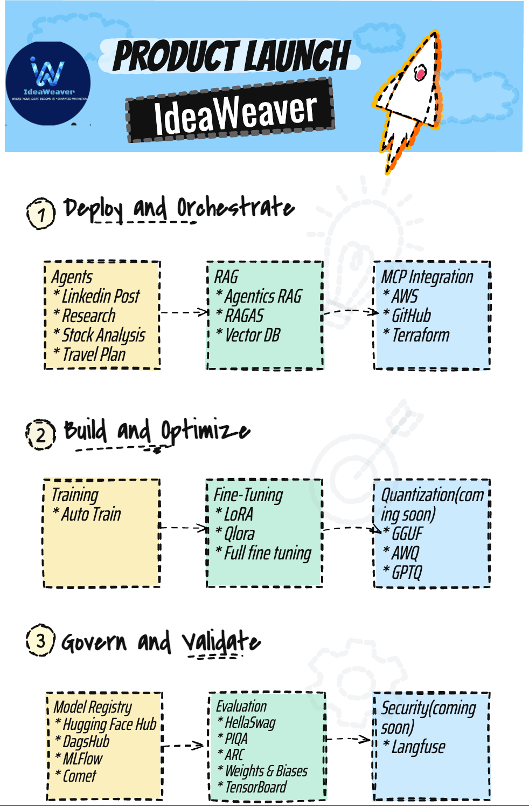

# IdeaWeaver

A comprehensive CLI tool for AI model training, evaluation, and deployment with advanced RAG capabilities and MCP (Model Context Protocol) integration. Train, fine-tune, and deploy language models with enterprise-grade features.

## Key Features

- **One-Click Setup** - Automated Python 3.12 environment with all dependencies
- **Advanced RAG** - Traditional + Agentic RAG with multiple vector stores
- **Flexible Training** - LoRA, QLoRA, and full fine-tuning support
- **Comprehensive Evaluation** - Built-in benchmarks + custom metrics
- **MCP Integration** - GitHub, Terraform and AWS connectors
- **Multi-Agent Workflows** - CrewAI pipeline support
- **Configuration Validation** - YAML validation and schema checking

## 🚀 Quick Start

### Installation

```bash
# One-line installation
curl -LsSf https://raw.githubusercontent.com/ideaweaver-ai-code/ideaweaver/refs/heads/main/setup_environments.sh | sh

# Or traditional installation
git clone https://github.com/ideaweaver-ai-code/ideaweaver.git
cd ideaweaver
chmod +x setup_environments.sh
./setup_environments.sh
```

### Environment Setup

> **⚠️ Important:** IdeaWeaver requires Python 3.12. Make sure you have Python 3.12 installed before proceeding.

1. **Check Python Version**
```bash
python --version
# Should show Python 3.12.x
```

2. **Activate the Environment**
```bash
# On Unix/macOS
source ideaweaver-env/bin/activate
```

3. **Verify Installation**
```bash
ideaweaver --help
```

## 📚 Documentation

For detailed documentation, tutorials, and guides, please visit our documentation website:
[IdeaWeaver Documentation](https://ideaweaver-ai-code.github.io/ideaweaver-docs/)

The documentation includes:
- Getting Started guides
- Tutorials
- Reference documentation
- API documentation
- Best practices
- Architecture overview
- Integration guides

## 🤝 Contributing

We welcome contributions! Please see our [Contributing Guide](docs/community/contributing.md) for details.

## 📄 License

This project is licensed under the MIT License - see the [LICENSE](LICENSE) file for details.

## 🌟 Features in Detail

### Model Training & Fine-tuning
- Support for LoRA, QLoRA, and full fine-tuning
- Integration with popular ML frameworks
- Automated hyperparameter optimization

### RAG Systems
- Multiple vector store support
- Advanced retrieval strategies
- Custom embedding models

### MCP Integration
- GitHub integration
- Terraform support
- AWS Bedrock deployment

### Evaluation & Benchmarking
- Built-in evaluation metrics
- Custom metric support
- Performance benchmarking tools

## 🔧 Core Components

- Model Training & Fine-tuning
- RAG Systems
- MCP Integration
- Evaluation & Benchmarking

## 📊 Example Workflows

- Complete Model Development Pipeline
- Multi-Agent Content Generation
- RAG System Implementation

## 🌟 Enterprise Features

- AWS Bedrock Integration
- Advanced Security Features
- Enterprise-grade Monitoring
- Scalable Deployment Options

For more information and detailed guides, please visit our [documentation website](https://ideaweaver-ai-code.github.io/ideaweaver-docs/).