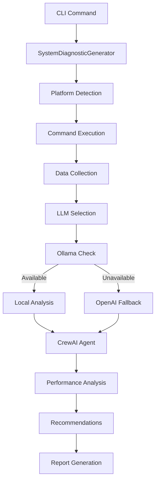

# IdeaWeaver System Diagnostics

🔧 **AI-Powered System Performance Analysis & Optimization**

The System Diagnostics feature is the first AI agent specifically designed for system performance debugging in DevOps workflows. It executes real Linux commands and provides intelligent recommendations using CrewAI framework with privacy-first local LLM support.

## 🌟 Key Features

- **Real Command Execution**: Executes actual system commands (not simulated output)
- **Platform Support**: Optimized for Linux environments
- **AI-Powered Analysis**: Uses CrewAI framework for intelligent system analysis
- **Privacy-First**: Ollama-first approach with OpenAI fallback
- **Comprehensive Coverage**: CPU, Memory, Network, and Process analysis
- **Actionable Recommendations**: Specific, prioritized optimization steps

## 🚀 Quick Start

```bash
# Basic system diagnostics
ideaweaver agent system_diagnostics

# Verbose output with detailed command execution
ideaweaver agent system_diagnostics --verbose

# Use OpenAI when Ollama is not available
ideaweaver agent system_diagnostics --openai-api-key sk-proj-XXXXXXX
```

## 🔍 What It Analyzes

### CPU & Load Analysis
- **Linux**: `w`, `top -b -n1`, load averages


### Memory Analysis
- **Linux**: `free -m`, swap usage

### Network Analysis
- **Linux**: `ip addr show`, `ip route show`, `ss -tuln`


### Process Analysis
- **Both**: Top processes, resource consumption, I/O patterns
- **Real-time**: Current system state analysis

## 🤖 AI Agent Architecture

The system uses a sophisticated AI agent workflow:

1. **Command Execution**: Real system commands are executed
2. **Data Collection**: Raw output is captured and structured
3. **AI Analysis**: CrewAI agent analyzes actual system metrics
4. **Recommendations**: Specific, actionable optimization steps
5. **Priority Ranking**: Issues ranked by urgency and impact

## 📊 Example Output

Here's a real example of the system diagnostics in action:

```bash
ideaweaver agent system_diagnostics --verbose --openai-api-key sk-proj-XXXXXXX
```

<details>
<summary>🖥️ <strong>Full Command Output</strong></summary>

```
🔧 Starting System Diagnostics Analysis...
🤖 Initializing diagnostic agents...
📋 LLM Priority: Ollama (local) → OpenAI (cloud)
🔍 Checking for Ollama availability...
⚠️ Ollama check failed: HTTPConnectionPool(host='localhost', port=11434): Max retries exceeded with url: /api/tags (Caused by NewConnectionError('<urllib3.connection.HTTPConnection object at 0x7ff1d264e360>: Failed to establish a new connection: [Errno 111] Connection refused'))
🔄 Setting up OpenAI...
✅ OpenAI setup successful
🔧 System Diagnostic Generator initialized with openai (gpt-4o-mini)
🖥️  Executing CPU & Load analysis...
🧠 Executing Memory analysis...
🌐 Executing Network analysis...
⚡ Executing Process & I/O analysis...
🔍 Analyzing real system diagnostics...

╭────────────────────────────────────────────────────────────────── Crew Execution Started ──────────────────────────────────────────────────────────────────╮
│                                                                                                                                                            │
│  Crew Execution Started                                                                                                                                    │
│  Name: crew                                                                                                                                                │
│  ID: 6ab3b553-f135-4dde-b9b1-17e5a93bb54e                                                                                                                  │
│                                                                                                                                                            │
╰────────────────────────────────────────────────────────────────────────────────────────────────────────────────────────────────────────────────────────────╯

# Agent: System Performance Advisor
## Task: Analyze the following REAL system diagnostic output and provide comprehensive
recommendations for system optimization and performance improvement.

ACTUAL SYSTEM DIAGNOSTIC DATA:
=== REAL SYSTEM DIAGNOSTIC OUTPUT ===

📋 CPU_LOAD DIAGNOSTICS:
Command: w
Status: SUCCESS
Output:
 22:23:07 up 31 min,  1 user,  load average: 0.80, 0.95, 0.99
USER     TTY      FROM             LOGIN@   IDLE   JCPU   PCPU  WHAT
ubuntu            18.206.107.28    22:18   27:24   0.00s  0.01s sshd: ubuntu [priv]

============================================================

📋 MEMORY DIAGNOSTICS:
Command: free -m
Status: SUCCESS
Output:
               total        used        free      shared  buff/cache   available
Mem:             957         903          71           0         126          54
Swap:              0           0           0

============================================================

📋 NETWORK DIAGNOSTICS:
Command: Network analysis commands
Status: SUCCESS
Output:
=== ip addr show ===
1: lo: <LOOPBACK,UP,LOWER_UP> mtu 65536 qdisc noqueue state UNKNOWN group default qlen 1000
    link/loopback 00:00:00:00:00:00 brd 00:00:00:00:00:00
    inet 127.0.0.1/8 scope host lo
       valid_lft forever preferred_lft forever
    inet6 ::1/128 scope host noprefixroute
       valid_lft forever preferred_lft forever
2: enX0: <BROADCAST,MULTICAST,UP,LOWER_UP> mtu 9001 qdisc fq_codel state UP group default qlen 1000
    link/ether 12:51:91:f2:3e:95 brd ff:ff:ff:ff:ff:ff
    inet 172.31.84.202/20 metric 100 brd 172.31.95.255 scope global dynamic enX0
       valid_lft 3548sec preferred_lft 3548sec
    inet6 fe80::1051:91ff:fef2:3e95/64 scope link
       valid_lft forever preferred_lft forever

=== ip route show ===
default via 172.31.80.1 dev enX0 proto dhcp src 172.31.84.202 metric 100
172.31.0.2 via 172.31.80.1 dev enX0 proto dhcp src 172.31.84.202 metric 100
172.31.80.0/20 dev enX0 proto kernel scope link src 172.31.84.202 metric 100
172.31.80.1 dev enX0 proto dhcp scope link src 172.31.84.202 metric 100

=== ss -tuln ===
Netid State  Recv-Q Send-Q      Local Address:Port Peer Address:PortProcess
udp   UNCONN 0      0              127.0.0.54:53        0.0.0.0:*          
udp   UNCONN 0      0           127.0.0.53%lo:53        0.0.0.0:*          
udp   UNCONN 0      0      172.31.84.202%enX0:68        0.0.0.0:*          
udp   UNCONN 0      0               127.0.0.1:323       0.0.0.0:*          
udp   UNCONN 0      0                   [::1]:323          [::]:*          
tcp   LISTEN 0      4096           127.0.0.54:53        0.0.0.0:*          
tcp   LISTEN 0      4096        127.0.0.53%lo:53        0.0.0.0:*          
tcp   LISTEN 0      4096                    *:22              *:*          

============================================================

📋 PROCESSES DIAGNOSTICS:
Command: top -b -n1
Status: SUCCESS
Output:
top - 22:23:08 up 31 min,  1 user,  load average: 0.80, 0.95, 0.99
Tasks: 109 total,   2 running, 107 sleeping,   0 stopped,   0 zombie
%Cpu(s):  4.0 us, 60.0 sy,  0.0 ni,  0.0 id, 28.0 wa,  0.0 hi,  4.0 si,  4.0 st
MiB Mem :    957.4 total,     68.4 free,    906.9 used,    125.4 buff/cache    
MiB Swap:      0.0 total,      0.0 free,      0.0 used.     50.5 avail Mem

    PID USER      PR  NI    VIRT    RES    SHR S  %CPU  %MEM     TIME+ COMMAND
    632 root      20   0 1856328  14336   2560 S  81.8   1.5   0:23.70 snapd
      1 root      20   0   22524   8540   4444 S   0.0   0.9   0:02.51 systemd
      2 root      20   0       0      0      0 S   0.0   0.0   0:00.00 kthreadd
    [... additional process output ...]

# Agent: System Performance Advisor
## Final Answer:

# System Performance Analysis Report

## 1. Overall System Health Assessment
The system is currently functional, but there are signs of resource constraints. The load averages indicate a moderate level of system stress, and memory usage is critically high with little available memory. The absence of swap space further exacerbates potential performance issues, particularly under high load scenarios.

## 2. CPU & Load Analysis
- **Load Averages**:
  - 1-minute: 0.80
  - 5-minute: 0.95
  - 15-minute: 0.99
 
- **CPU Usage**:
  - User: 4.0%
  - System: 60.0% (indicates heavy system-level processing)
  - Wait: 28.0% (high wait time suggests potential I/O bottlenecks)

### Conclusion:
The system is experiencing moderate load but has a high percentage of time spent in kernel mode, implying potential performance bottlenecks related to I/O operations.

## 3. Memory Analysis
- **Memory Usage**:
  - Total: 957 MB
  - Used: 903 MB (94% utilization)
  - Free: 71 MB
  - Available: 54 MB

### Key Observations:
- The system is using approximately 94% of its RAM, leaving only 54 MB available
- The absence of swap space means the system cannot offload excess memory usage to disk
- Risk of out-of-memory (OOM) scenarios under increased load

## 4. Network Analysis
- **Network Interfaces**: Active interface `enX0` with IP `172.31.84.202`
- **Connections**: Listening on port 22 (SSH), no suspicious connections detected
- **Conclusion**: Network setup appears to be functioning correctly

## 5. Process Analysis
- **High Resource Consumption**:
  - PID 632 (snapd): consuming 81.8% CPU and 1.5% memory
  - PID 4410 (python): consuming 62.7% memory

## 6. Actionable Recommendations

### 🔴 Critical Priority
1. **Add Swap Space** - Immediate risk of OOM
```bash
sudo fallocate -l 1G /swapfile
sudo chmod 600 /swapfile
sudo mkswap /swapfile
sudo swapon /swapfile
echo '/swapfile none swap sw 0 0' | sudo tee -a /etc/fstab
```

### 🟡 High Priority
2. **Investigate High CPU Processes**
```bash
# Review snapd process - consider stopping if not needed
sudo systemctl stop snapd
sudo systemctl disable snapd
```

3. **Optimize Resource-Heavy Applications**
   - Check PID 4410 (python) for performance issues

### 🟢 Medium Priority
4. **Continuous Monitoring**: Implement `htop`, `iotop`, or `glances`
5. **Service Optimization**: Review and disable unnecessary services

By following these recommendations, the overall system performance should improve, reducing bottlenecks and increasing responsiveness during peak loads.

================================================================================
🔍 SYSTEM DIAGNOSTIC REPORT
🤖 Generated by: openai (gpt-4o-mini)
👥 Agents: System Performance Advisor
================================================================================

💡 Next Steps:
• Review the recommendations above
• Execute suggested commands to optimize performance
• Monitor system performance after implementing changes
• Run diagnostics again to verify improvements
```

</details>

## 🛠️ Technical Implementation

### LLM Selection Strategy
1. **Primary**: Ollama (local, privacy-first)
2. **Fallback**: OpenAI (cloud, when Ollama unavailable)
3. **Models**: Supports any Ollama model or OpenAI GPT variants

### Platform-Specific Commands

| System Aspect | Linux Commands | macOS Commands |
|---------------|----------------|----------------|
| **CPU/Load** | `w`, `top -b -n1` | `w`, `top -l 1 -n 10`, `uptime` |
| **Memory** | `free -m` | `vm_stat` |
| **Network** | `ip addr show`, `ss -tuln` | `ifconfig`, `netstat -rn` |
| **Processes** | `top -b -n1` | `top -l 1 -n 10` |

### Error Handling
- Graceful command failure handling
- Cross-platform compatibility checks
- Detailed error reporting with troubleshooting tips

## 🔧 Configuration Options

### Command Line Arguments
- `--verbose`: Enable detailed execution logging
- `--openai-api-key`: Specify OpenAI API key for cloud analysis
- `--help`: Show all available options

### Environment Variables
- `OPENAI_API_KEY`: Set OpenAI API key via environment
- `OLLAMA_HOST`: Custom Ollama server endpoint (default: localhost:11434)

## 🏗️ Architecture Overview



## 🚀 Getting Started

### Prerequisites
- Python 3.12+
- IdeaWeaver installed and configured
- Optional: Ollama for local AI analysis
- Optional: OpenAI API key for cloud analysis

### Installation
```bash
# IdeaWeaver includes system diagnostics by default
ideaweaver --help
ideaweaver agent --help
```

### First Run
```bash
# Start with basic diagnostics
ideaweaver agent system_diagnostics

# For detailed output and troubleshooting
ideaweaver agent system_diagnostics --verbose
```

## 💡 Use Cases

- **DevOps Troubleshooting**: Quick system health checks
- **Performance Optimization**: Identify bottlenecks and optimization opportunities
- **Capacity Planning**: Understand resource utilization patterns
- **Security Auditing**: Review running processes and network connections
- **Infrastructure Monitoring**: Regular system health assessments

## 🔒 Privacy & Security

- **Local-First**: Ollama processing keeps data on your machine
- **No Data Storage**: No diagnostic data is stored or transmitted unnecessarily
- **Secure Commands**: Only reads system state, no modifications made
- **API Key Safety**: OpenAI keys are used only when explicitly provided

## 🤝 Contributing

The system diagnostics feature is part of the main IdeaWeaver project. Contributions welcome for:
- Additional platform support
- New diagnostic commands
- Enhanced AI analysis capabilities
- Performance optimizations

## 📚 Related Documentation

- [Main IdeaWeaver README](README.md)
- [CrewAI Integration](ideaweaver/crew_ai.py)
- [CLI Commands](ideaweaver/cli.py)
- [Agent Framework](ideaweaver/crew_ai.py)

## 🐛 Troubleshooting

### Common Issues

**Ollama Connection Failed**
```
⚠️ Ollama check failed: HTTPConnectionPool(host='localhost', port=11434)
```
- **Solution**: Install and start Ollama, or use `--openai-api-key` flag

**Command Not Found**
```
❌ Error running system diagnostics: Command 'free' not found
```
- **Solution**: Platform-specific commands are automatically selected

**Permission Denied**
```
❌ Error: Permission denied accessing system information
```
- **Solution**: Some commands may require sudo privileges on certain systems

### Getting Help
- Use `--verbose` flag for detailed execution logs
- Check [Issues](https://github.com/ideaweaver-ai-code/ideaweaver/issues) for known problems
- Report new issues with full error output

---

**⭐ If you find this feature useful, please star the [IdeaWeaver repository](https://github.com/ideaweaver-ai-code/ideaweaver)!** 