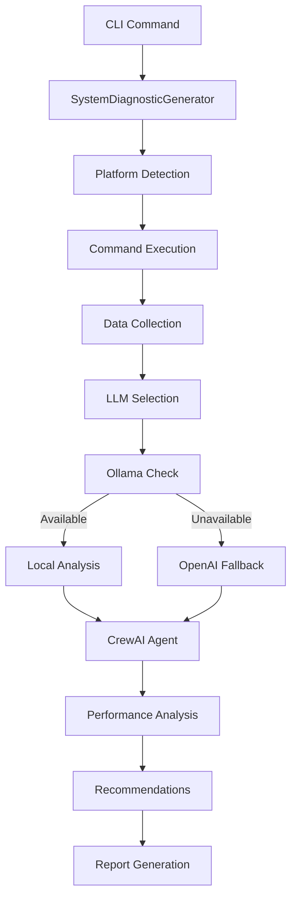

# IdeaWeaver System Diagnostics

🔧 **AI-Powered System Performance Analysis & Optimization**

The System Diagnostics feature is the first AI agent specifically designed for system performance debugging in DevOps workflows. It executes real Linux commands and provides intelligent recommendations using CrewAI framework with privacy-first local LLM support.

## 🌟 Key Features

- **Real Command Execution**: Executes actual system commands (not simulated output)
- **Platform Support**: Optimized for Linux environments
- **AI-Powered Analysis**: Uses CrewAI framework for intelligent system analysis
- **Privacy-First**: Ollama-first approach with OpenAI fallback
- **Comprehensive Coverage**: CPU, Memory, Network, and Process analysis
- **Actionable Recommendations**: Specific, prioritized optimization steps

## 🚀 Quick Start

```bash
# Basic system diagnostics
ideaweaver agent system_diagnostics

# Verbose output with detailed command execution
ideaweaver agent system_diagnostics --verbose

# Use OpenAI when Ollama is not available
ideaweaver agent system_diagnostics --openai-api-key sk-proj-XXXXXXX
```

## 🔍 What It Analyzes

### CPU & Load Analysis
- **Linux**: `w`, `top -b -n1`, load averages


### Memory Analysis
- **Linux**: `free -m`, swap usage

### Network Analysis
- **Linux**: `ip addr show`, `ip route show`, `ss -tuln`


### Process Analysis
- **Both**: Top processes, resource consumption, I/O patterns
- **Real-time**: Current system state analysis

## 🤖 AI Agent Architecture

The system uses a sophisticated AI agent workflow:

1. **Command Execution**: Real system commands are executed
2. **Data Collection**: Raw output is captured and structured
3. **AI Analysis**: CrewAI agent analyzes actual system metrics
4. **Recommendations**: Specific, actionable optimization steps
5. **Priority Ranking**: Issues ranked by urgency and impact

## 📊 Example Output

Here's a real example of the system diagnostics in action:

```bash
ideaweaver agent system_diagnostics --verbose --openai-api-key sk-proj-XXXXXXX
```

<details>
<summary>🖥️ <strong>Full Command Output</strong></summary>

```
ideaweaver agent system_diagnostics --verbose --openai-api-key sk-proj-XXXXXXX
🔧 Starting System Diagnostics Analysis...
🤖 Initializing diagnostic agents...
📋 LLM Priority: Ollama (local) → OpenAI (cloud)
🔍 Checking for Ollama availability...
⚠️ Ollama check failed: HTTPConnectionPool(host='localhost', port=11434): Max retries exceeded with url: /api/tags (Caused by NewConnectionError('<urllib3.connection.HTTPConnection object at 0x7ff1d264e360>: Failed to establish a new connection: [Errno 111] Connection refused'))
🔄 Setting up OpenAI...
✅ OpenAI setup successful
🔧 System Diagnostic Generator initialized with openai (gpt-4o-mini)
🖥️  Executing CPU & Load analysis...
🧠 Executing Memory analysis...
🌐 Executing Network analysis...
⚡ Executing Process & I/O analysis...
🔍 Analyzing real system diagnostics...
╭────────────────────────────────────────────────────────────────── Crew Execution Started ──────────────────────────────────────────────────────────────────╮
│                                                                                                                                                            │
│  Crew Execution Started                                                                                                                                    │
│  Name: crew                                                                                                                                                │
│  ID: 6ab3b553-f135-4dde-b9b1-17e5a93bb54e                                                                                                                  │
│                                                                                                                                                            │
│                                                                                                                                                            │
╰────────────────────────────────────────────────────────────────────────────────────────────────────────────────────────────────────────────────────────────╯

# Agent: System Performance Advisor
## Task: Analyze the following REAL system diagnostic output and provide comprehensive
recommendations for system optimization and performance improvement.

ACTUAL SYSTEM DIAGNOSTIC DATA:
=== REAL SYSTEM DIAGNOSTIC OUTPUT ===

📋 CPU_LOAD DIAGNOSTICS:
Command: w
Status: SUCCESS
Output:
 22:23:07 up 31 min,  1 user,  load average: 0.80, 0.95, 0.99
USER     TTY      FROM             LOGIN@   IDLE   JCPU   PCPU  WHAT
ubuntu            18.206.107.28    22:18   27:24   0.00s  0.01s sshd: ubuntu [priv]

============================================================

📋 MEMORY DIAGNOSTICS:
Command: free -m
Status: SUCCESS
Output:
               total        used        free      shared  buff/cache   available
Mem:             957         903          71           0         126          54
Swap:              0           0           0

============================================================

📋 NETWORK DIAGNOSTICS:
Command: Network analysis commands
Status: SUCCESS
Output:
=== ip addr show ===
1: lo: <LOOPBACK,UP,LOWER_UP> mtu 65536 qdisc noqueue state UNKNOWN group default qlen 1000
    link/loopback 00:00:00:00:00:00 brd 00:00:00:00:00:00
    inet 127.0.0.1/8 scope host lo
       valid_lft forever preferred_lft forever
    inet6 ::1/128 scope host noprefixroute
       valid_lft forever preferred_lft forever
2: enX0: <BROADCAST,MULTICAST,UP,LOWER_UP> mtu 9001 qdisc fq_codel state UP group default qlen 1000
    link/ether 12:51:91:f2:3e:95 brd ff:ff:ff:ff:ff:ff
    inet 172.31.84.202/20 metric 100 brd 172.31.95.255 scope global dynamic enX0
       valid_lft 3548sec preferred_lft 3548sec
    inet6 fe80::1051:91ff:fef2:3e95/64 scope link
       valid_lft forever preferred_lft forever


=== ip route show ===
default via 172.31.80.1 dev enX0 proto dhcp src 172.31.84.202 metric 100
172.31.0.2 via 172.31.80.1 dev enX0 proto dhcp src 172.31.84.202 metric 100
172.31.80.0/20 dev enX0 proto kernel scope link src 172.31.84.202 metric 100
172.31.80.1 dev enX0 proto dhcp scope link src 172.31.84.202 metric 100


=== ss -tuln ===
Netid State  Recv-Q Send-Q      Local Address:Port Peer Address:PortProcess
udp   UNCONN 0      0              127.0.0.54:53        0.0.0.0:*          
udp   UNCONN 0      0           127.0.0.53%lo:53        0.0.0.0:*          
udp   UNCONN 0      0      172.31.84.202%enX0:68        0.0.0.0:*          
udp   UNCONN 0      0               127.0.0.1:323       0.0.0.0:*          
udp   UNCONN 0      0                   [::1]:323          [::]:*          
tcp   LISTEN 0      4096           127.0.0.54:53        0.0.0.0:*          
tcp   LISTEN 0      4096        127.0.0.53%lo:53        0.0.0.0:*          
tcp   LISTEN 0      4096                    *:22              *:*          

============================================================

📋 PROCESSES DIAGNOSTICS:
Command: top -b -n1
Status: SUCCESS
Output:
top - 22:23:08 up 31 min,  1 user,  load average: 0.80, 0.95, 0.99
Tasks: 109 total,   2 running, 107 sleeping,   0 stopped,   0 zombie
%Cpu(s):  4.0 us, 60.0 sy,  0.0 ni,  0.0 id, 28.0 wa,  0.0 hi,  4.0 si,  4.0 st
MiB Mem :    957.4 total,     68.4 free,    906.9 used,    125.4 buff/cache    
MiB Swap:      0.0 total,      0.0 free,      0.0 used.     50.5 avail Mem

    PID USER      PR  NI    VIRT    RES    SHR S  %CPU  %MEM     TIME+ COMMAND
    632 root      20   0 1856328  14336   2560 S  81.8   1.5   0:23.70 snapd
      1 root      20   0   22524   8540   4444 S   0.0   0.9   0:02.51 systemd
      2 root      20   0       0      0      0 S   0.0   0.0   0:00.00 kthreadd
      3 root      20   0       0      0      0 S   0.0   0.0   0:00.00 pool_wo+
      4 root       0 -20       0      0      0 I   0.0   0.0   0:00.00 kworker+
      5 root       0 -20       0      0      0 I   0.0   0.0   0:00.00 kworker+
      6 root       0 -20       0      0      0 I   0.0   0.0   0:00.00 kworker+
      7 root       0 -20       0      0      0 I   0.0   0.0   0:00.00 kworker+
     10 root       0 -20       0      0      0 I   0.0   0.0   0:00.00 kworker+
     11 root      20   0       0      0      0 I   0.0   0.0   0:05.58 kworker+
     12 root       0 -20       0      0      0 I   0.0   0.0   0:00.00 kworker+
     13 root      20   0       0      0      0 I   0.0   0.0   0:00.00 rcu_tas+
     14 root      20   0       0      0      0 I   0.0   0.0   0:00.00 rcu_tas+
     15 root      20   0       0      0      0 S   0.0   0.0   0:00.71 ksoftir+
     16 root      20   0       0      0      0 R   0.0   0.0   0:00.70 rcu_sch+
     17 root      rt   0       0      0      0 S   0.0   0.0   0:00.01 migrati+
     18 root     -51   0       0      0      0 S   0.0   0.0   0:00.00 idle_in+
     19 root      20   0       0      0      0 S   0.0   0.0   0:00.00 cpuhp/0
     20 root      20   0       0      0      0 S   0.0   0.0   0:00.00 kdevtmp+
     21 root       0 -20       0      0      0 I   0.0   0.0   0:00.00 kworker+
     23 root      20   0       0      0      0 S   0.0   0.0   0:00.00 kauditd
     24 root      20   0       0      0      0 S   0.0   0.0   0:00.00 khungta+
     25 root      20   0       0      0      0 S   0.0   0.0   0:00.00 oom_rea+
     26 root      20   0       0      0      0 I   0.0   0.0   0:03.60 kworker+
     27 root       0 -20       0      0      0 I   0.0   0.0   0:00.00 kworker+
     28 root      20   0       0      0      0 S   0.0   0.0   0:00.80 kcompac+
     29 root      25   5       0      0      0 S   0.0   0.0   0:00.00 ksmd
     30 root      39  19       0      0      0 S   0.0   0.0   0:00.00 khugepa+
     31 root       0 -20       0      0      0 I   0.0   0.0   0:00.00 kworker+
     32 root       0 -20       0      0      0 I   0.0   0.0   0:00.00 kworker+
     33 root       0 -20       0      0      0 I   0.0   0.0   0:00.00 kworker+
     34 root     -51   0       0      0      0 S   0.0   0.0   0:00.00 irq/9-a+
     35 root      20   0       0      0      0 S   0.0   0.0   0:00.00 xen-bal+
     36 root       0 -20       0      0      0 I   0.0   0.0   0:00.00 kworker+
     37 root       0 -20       0      0      0 I   0.0   0.0   0:00.00 kworker+
     38 root       0 -20       0      0      0 I   0.0   0.0   0:00.00 kworker+
     39 root       0 -20       0      0      0 I   0.0   0.0   0:00.00 kworker+
     40 root       0 -20       0      0      0 I   0.0   0.0   0:00.00 kworker+
     41 root       0 -20       0      0      0 I   0.0   0.0   0:00.00 kworker+
     42 root     -51   0       0      0      0 S   0.0   0.0   0:00.00 watchdo+
     43 root       0 -20       0      0      0 I   0.0   0.0   0:02.41 kworker+
     44 root      20   0       0      0      0 S   0.0   0.0   1:06.59 kswapd0
     45 root      20   0       0      0      0 S   0.0   0.0   0:00.00 ecryptf+
     46 root       0 -20       0      0      0 I   0.0   0.0   0:00.00 kworker+
     47 root       0 -20       0      0      0 I   0.0   0.0   0:00.00 kworker+
     48 root      20   0       0      0      0 S   0.0   0.0   0:00.00 xenbus
     49 root      20   0       0      0      0 S   0.0   0.0   0:00.01 xenwatch
     50 root       0 -20       0      0      0 I   0.0   0.0   0:00.00 kworker+
     51 root       0 -20       0      0      0 I   0.0   0.0   0:00.00 kworker+
     52 root       0 -20       0      0      0 I   0.0   0.0   0:00.00 kworker+
     53 root       0 -20       0      0      0 I   0.0   0.0   0:00.00 kworker+
     54 root      20   0       0      0      0 S   0.0   0.0   0:00.00 scsi_eh+
     55 root       0 -20       0      0      0 I   0.0   0.0   0:00.00 kworker+
     56 root      20   0       0      0      0 S   0.0   0.0   0:00.00 scsi_eh+
     57 root       0 -20       0      0      0 I   0.0   0.0   0:00.00 kworker+
     59 root       0 -20       0      0      0 I   0.0   0.0   0:00.00 kworker+
     60 root       0 -20       0      0      0 I   0.0   0.0   0:00.00 kworker+
     68 root       0 -20       0      0      0 I   0.0   0.0   0:00.00 kworker+
     70 root       0 -20       0      0      0 I   0.0   0.0   0:00.00 kworker+
     83 root       0 -20       0      0      0 I   0.0   0.0   0:00.00 kworker+
     84 root      20   0       0      0      0 S   0.0   0.0   0:00.60 jbd2/xv+
     85 root       0 -20       0      0      0 I   0.0   0.0   0:00.00 kworker+
    125 root      19  -1   50344   4668   3516 S   0.0   0.5   0:00.33 systemd+
    162 root       0 -20       0      0      0 I   0.0   0.0   0:00.00 kworker+
    163 root       0 -20       0      0      0 I   0.0   0.0   0:00.00 kworker+
    184 root      rt   0  288952  27136   8704 S   0.0   2.8   0:00.15 multipa+
    195 root      20   0   26180   6492   3676 S   0.0   0.7   0:00.26 systemd+
    209 root      -2   0       0      0      0 S   0.0   0.0   0:00.00 psimon
    260 root      20   0       0      0      0 S   0.0   0.0   0:00.00 jbd2/xv+
    261 root       0 -20       0      0      0 I   0.0   0.0   0:00.00 kworker+
    300 systemd+  20   0   21584   6144   3840 S   0.0   0.6   0:00.12 systemd+
    322 root       0 -20       0      0      0 I   0.0   0.0   0:00.00 kworker+
    511 systemd+  20   0   22396   4096   2944 S   0.0   0.4   0:00.09 systemd+
    614 root      20   0    2720   1920   1792 S   0.0   0.2   0:00.00 acpid
    618 root      20   0    7224   2432   2176 S   0.0   0.2   0:00.01 cron
    619 message+  20   0    9788   4608   3840 S   0.0   0.5   0:00.09 dbus-da+
    626 root      20   0   32416  13440   3328 S   0.0   1.4   0:00.08 network+
    627 polkitd   20   0  383704   6036   3712 S   0.0   0.6   0:00.34 polkitd
    640 root      20   0   18032   5248   4224 S   0.0   0.5   0:00.24 systemd+
    646 root      20   0  468820   5760   3712 S   0.0   0.6   0:00.39 udisksd
    733 _chrony   20   0   19400   3284   2560 S   0.0   0.3   0:00.61 chronyd
    734 root      20   0    6148   1920   1792 S   0.0   0.2   0:00.00 agetty
    741 _chrony   20   0   11072   2032   1536 S   0.0   0.2   0:00.00 chronyd
    778 root      20   0  110004  12800   3456 S   0.0   1.3   0:00.08 unatten+
    785 syslog    20   0  222508   4864   3328 S   0.0   0.5   0:00.04 rsyslogd
    825 root      20   0  391872   5120   3328 S   0.0   0.5   0:00.06 ModemMa+
    833 root      20   0    6104   1792   1664 S   0.0   0.2   0:00.03 agetty
    997 root      20   0 1685572   8464    128 S   0.0   0.9   0:10.12 amazon-+
   1065 root      20   0   12020   3328   2304 S   0.0   0.3   0:00.00 sshd
   1563 root       0 -20       0      0      0 I   0.0   0.0   0:00.00 kworker+
   3705 root      20   0       0      0      0 I   0.0   0.0   0:00.05 kworker+
   3747 root      20   0       0      0      0 I   0.0   0.0   0:00.80 kworker+
   3770 root      20   0       0      0      0 I   0.0   0.0   0:00.19 kworker+
   3968 root      20   0       0      0      0 I   0.0   0.0   0:00.44 kworker+
   3986 root      20   0   14704   4352   2688 S   0.0   0.4   0:00.01 sshd
   4331 root      -2   0       0      0      0 S   0.0   0.0   0:00.00 psimon
   4333 ubuntu    20   0   20160   4864   2944 S   0.0   0.5   0:00.07 systemd
   4334 ubuntu    20   0   21144   2748   1024 S   0.0   0.3   0:00.00 (sd-pam)
   4398 ubuntu    20   0   14960   3868   1920 S   0.0   0.4   0:00.11 sshd
   4399 ubuntu    20   0    9056   3712   2048 S   0.0   0.4   0:00.01 bash
   4408 root      20   0   17136   3840   2688 S   0.0   0.4   0:00.05 sudo
   4409 root      20   0   17136   2244   1024 S   0.0   0.2   0:00.00 sudo
   4410 root      20   0    9188   3840   2048 S   0.0   0.4   0:00.04 bash
   4512 root      20   0       0      0      0 I   0.0   0.0   0:00.00 kworker+
   4539 root      20   0    7740   2048   1792 S   0.0   0.2   0:00.00 ideawea+
   4541 root      20   0 1606852 614556   4608 S   0.0  62.7   0:13.19 python
   4556 root      20   0   12360   4992   2944 R   0.0   0.5   0:00.00 top
   4557 root      20   0   26184   4980   2176 S   0.0   0.5   0:00.00 (udev-w+
   4558 root      20   0   26184   4980   2176 S   0.0   0.5   0:00.00 (udev-w+

============================================================


Based on this REAL diagnostic data, provide:

1. **Overall System Health Assessment**: Evaluate the current system state based on actual metrics.

2. **CPU & Load Analysis**:
   - Interpret the actual load averages shown
   - Consider the number of CPU cores when assessing load
   - Identify if the system is appropriately loaded or has issues

3. **Memory Analysis**:
   - Analyze the real memory usage data
   - Identify any memory pressure or issues
   - Provide specific recommendations based on actual usage

4. **Network Analysis**:
   - Review actual network interface data
   - Identify any network-related issues from real output
   - Check actual network connections and ports

5. **Process Analysis**:
   - Identify actual processes consuming resources
   - Analyze real I/O and CPU usage patterns
   - Recommend specific actions based on actual process data

6. **Actionable Recommendations**:
   - Provide specific steps based on the actual system state
   - Include real command examples where appropriate
   - Focus on addressing issues found in the real data

7. **Priority Assessment**: Rank recommendations by actual urgency based on real metrics

IMPORTANT: Base all analysis on the actual command output provided, not on assumptions or generic advice.


# Agent: System Performance Advisor
## Final Answer:
# System Performance Analysis Report

## 1. Overall System Health Assessment
The system is currently functional, but there are signs of resource constraints. The load averages indicate a moderate level of system stress, and memory usage is critically high with little available memory. The absence of swap space further exacerbates potential performance issues, particularly under high load scenarios.

## 2. CPU & Load Analysis
- **Load Averages**:
  - 1-minute: 0.80
  - 5-minute: 0.95
  - 15-minute: 0.99
 
  Given these values, the load average is reasonably low for systems with up to 4 CPU cores. If the system has fewer cores, this may indicate a nearing threshold for CPU resource contention.
 
- **CPU Usage**:
  - User: 4.0%
  - System: 60.0% (indicates a heavy amount of system-level processing)
  - Wait: 28.0% (high wait time suggests potential I/O bottlenecks)
 
  The high percentage of system CPU usage indicates that the system is spending a significant amount of time executing kernel processes, which could be linked to I/O operations or other resource contention.

### Conclusion:
The system is experiencing moderate load but has a high percentage of time spent in kernel mode. This implies potential performance bottlenecks, likely related to I/O operations.

## 3. Memory Analysis
- **Memory Usage**:
  - Total: 957 MB
  - Used: 903 MB
  - Free: 71 MB
  - Buff/cache: 126 MB
  - Available: 54 MB

### Key Observations:
- The system is using approximately 94% of its RAM, leaving only 54 MB available, which can lead to performance degradation under load.
- The absence of swap space means the system cannot offload any excess memory usage to disk, risking out-of-memory (OOM) scenarios.

### Recommendations:
- **Add Swap Space**: Create a swap file to provide additional virtual memory, which can help alleviate memory pressure. Use the following commands:
```bash
sudo fallocate -l 1G /swapfile
sudo chmod 600 /swapfile
sudo mkswap /swapfile
sudo swapon /swapfile
echo '/swapfile none swap sw 0 0' | sudo tee -a /etc/fstab
```

## 4. Network Analysis
- **Network Interfaces**:
  - Active interface: `enX0` with IP `172.31.84.202`
  - No apparent issues with the network interface as it is up and configured correctly.

- **Connections**:
  - Listening on port 22 (SSH), which is expected.
  - No suspicious connections detected in the `ss -tuln` output.

### Conclusion:
The network setup appears to be functioning correctly without issues.

## 5. Process Analysis
- **High Resource Consumption**:
  - PID 632 (snapd) is consuming 81.8% CPU and 1.5% memory.
  - PID 4410 (python) is consuming 62.7% memory, indicating a potential application issue or inefficiency.

### Recommendations:
- **Investigate High CPU Usage**:
  - Review the snapd process; if it's not necessary, consider stopping or disabling it:
```bash
sudo systemctl stop snapd
sudo systemctl disable snapd
```
- **Optimize or Restart Resource-Heavy Applications**:
  - Check PID 4410 (python) for performance issues or optimize its code.

## 6. Actionable Recommendations
1. **Add Swap Space**: [High Priority]
   - Follow the commands provided in the memory analysis section to add a swap file.
   
2. **Investigate High CPU Processes**: [Medium Priority]
   - Use `top` or `htop` to monitor and analyze `snapd` and `python` processes to identify inefficiencies.

3. **Optimize System Services**: [Medium Priority]
   - Review and disable unnecessary services to reduce system load and free up resources.

4. **Monitor System Performance**: [Ongoing]
   - Implement monitoring tools such as `htop`, `iotop`, or `glances` for continuous observation.

5. **Consider Hardware Upgrade**: [Long-term]
   - If performance issues persist, consider upgrading RAM or CPU based on workload requirements.

## 7. Priority Assessment
- **Critical**: Add swap space (immediate risk of OOM).
- **High**: Investigate and optimize resource-heavy processes.
- **Medium**: Continuous monitoring and service optimization.
- **Low**: Hardware upgrades based on future assessments.

By following these recommendations, the overall system performance should improve, reducing bottlenecks and increasing responsiveness during peak loads.
================================================================================

💡 Next Steps:
• Review the recommendations above
• Execute suggested commands to optimize performance
• Monitor system performance after implementing changes
• Run diagnostics again to verify improvements
```

</details>

## 🛠️ Technical Implementation

### LLM Selection Strategy
1. **Primary**: Ollama (local, privacy-first)
2. **Fallback**: OpenAI (cloud, when Ollama unavailable)
3. **Models**: Supports any Ollama model or OpenAI GPT variants

### Platform-Specific Commands

| System Aspect | Linux Commands | macOS Commands |
|---------------|----------------|----------------|
| **CPU/Load** | `w`, `top -b -n1` | `w`, `top -l 1 -n 10`, `uptime` |
| **Memory** | `free -m` | `vm_stat` |
| **Network** | `ip addr show`, `ss -tuln` | `ifconfig`, `netstat -rn` |
| **Processes** | `top -b -n1` | `top -l 1 -n 10` |

### Error Handling
- Graceful command failure handling
- Cross-platform compatibility checks
- Detailed error reporting with troubleshooting tips

## 🔧 Configuration Options

### Command Line Arguments
- `--verbose`: Enable detailed execution logging
- `--openai-api-key`: Specify OpenAI API key for cloud analysis
- `--help`: Show all available options

### Environment Variables
- `OPENAI_API_KEY`: Set OpenAI API key via environment
- `OLLAMA_HOST`: Custom Ollama server endpoint (default: localhost:11434)

## 🏗️ Architecture Overview




## 🚀 Getting Started

### Prerequisites
- Python 3.12+
- IdeaWeaver installed and configured
- Optional: Ollama for local AI analysis
- Optional: OpenAI API key for cloud analysis

### Installation
```bash
# IdeaWeaver includes system diagnostics by default
ideaweaver --help
ideaweaver agent --help
```

### First Run
```bash
# Start with basic diagnostics
ideaweaver agent system_diagnostics

# For detailed output and troubleshooting
ideaweaver agent system_diagnostics --verbose
```

## 💡 Use Cases

- **DevOps Troubleshooting**: Quick system health checks
- **Performance Optimization**: Identify bottlenecks and optimization opportunities
- **Capacity Planning**: Understand resource utilization patterns
- **Security Auditing**: Review running processes and network connections
- **Infrastructure Monitoring**: Regular system health assessments

## 🔒 Privacy & Security

- **Local-First**: Ollama processing keeps data on your machine
- **No Data Storage**: No diagnostic data is stored or transmitted unnecessarily
- **Secure Commands**: Only reads system state, no modifications made
- **API Key Safety**: OpenAI keys are used only when explicitly provided

## 🤝 Contributing

The system diagnostics feature is part of the main IdeaWeaver project. Contributions welcome for:
- Additional platform support
- New diagnostic commands
- Enhanced AI analysis capabilities
- Performance optimizations

## 📚 Related Documentation

- [Main IdeaWeaver README](README.md)
- [CrewAI Integration](ideaweaver/crew_ai.py)
- [CLI Commands](ideaweaver/cli.py)
- [Agent Framework](ideaweaver/crew_ai.py)

## 🐛 Troubleshooting

### Common Issues

**Ollama Connection Failed**
```
⚠️ Ollama check failed: HTTPConnectionPool(host='localhost', port=11434)
```
- **Solution**: Install and start Ollama, or use `--openai-api-key` flag

**Command Not Found**
```
❌ Error running system diagnostics: Command 'free' not found
```
- **Solution**: Platform-specific commands are automatically selected

**Permission Denied**
```
❌ Error: Permission denied accessing system information
```
- **Solution**: Some commands may require sudo privileges on certain systems

### Getting Help
- Use `--verbose` flag for detailed execution logs
- Check [Issues](https://github.com/ideaweaver-ai-code/ideaweaver/issues) for known problems
- Report new issues with full error output

---

**⭐ If you find this feature useful, please star the [IdeaWeaver repository](https://github.com/ideaweaver-ai-code/ideaweaver)!** 