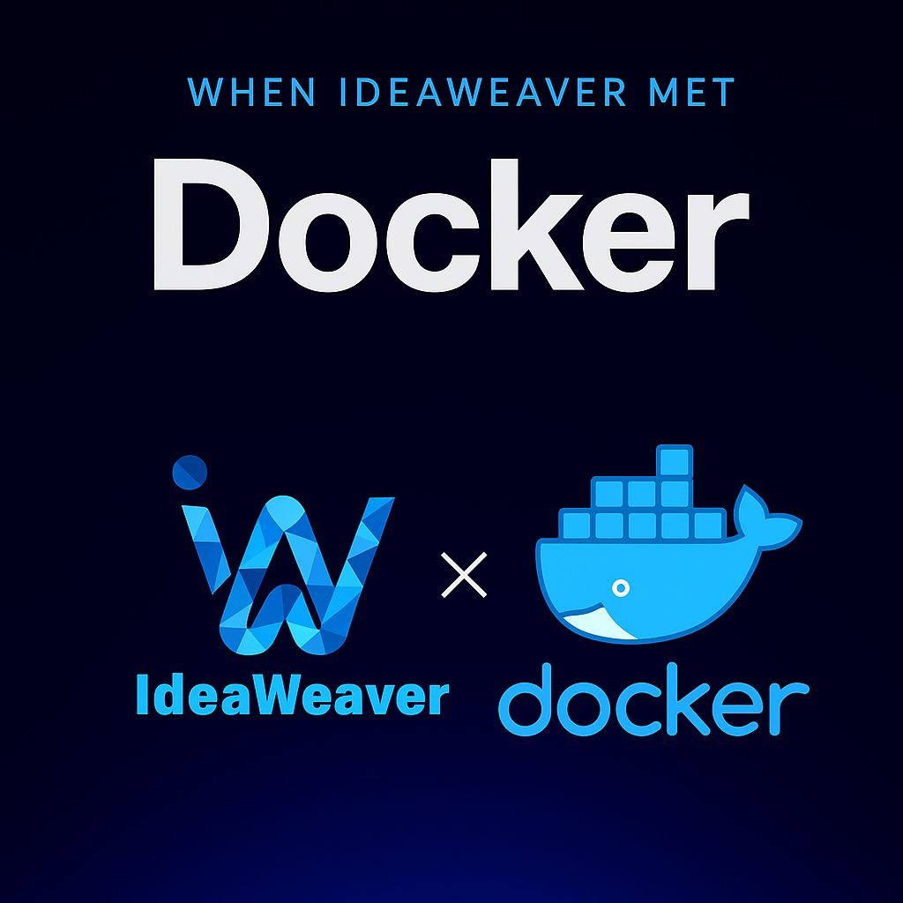

# IdeaWeaver Docker CLI Command Outputs

## 1. Build Docker Image



**Command:**
```sh
ideaweaver docker build --model-path test_model/ --image-name ideaweaver-test:latest
```

**Output:**
```
✅ Docker image built successfully: ideaweaver-test:latest

🎉 Docker image built successfully!
   Image: ideaweaver-test:latest
   Model: test_model/

🚀 To run the container:
   docker run -p 8000:8000 ideaweaver-test:latest

🔍 To test the API:
   curl http://localhost:8000/health
```

---

## 2. List Docker Images

**Command:**
```sh
ideaweaver docker list
```

**Output:**
```
📋 IdeaWeaver Docker Images:
   ideaweaver-test:latest
   test-model:latest
   langfuse/langfuse-worker:3
   langfuse/langfuse:3
   clickhouse/clickhouse-server:latest
   redis:7
   minio/minio:latest
   ghcr.io/github/github-mcp-server:latest
   postgres:latest
   hashicorp/terraform-mcp-server:latest
```

---

## 3. Run Docker Container

**Command:**
```sh
ideaweaver docker run --image-name ideaweaver-test:latest
```

**Output:**
```
✅ Container started successfully

🎉 Container started successfully!
   Container: auto-generated
   Access URL: http://localhost:8000
   Health Check: http://localhost:8000/health
   API Docs: http://localhost:8000/docs
```

---

🎉 Docker image built successfully!
   Image: ideaweaver-test:latest
   Model: test_model/

🚀 To run the container:
   docker run -p 8000:8000 ideaweaver-test:latest

🔍 To test the API:
   curl http://localhost:8000/health

📋 IdeaWeaver Docker Images:
   ideaweaver-test:latest
   test-model:latest
   langfuse/langfuse-worker:3
   langfuse/langfuse:3
   clickhouse/clickhouse-server:latest
   redis:7
   minio/minio:latest
   ghcr.io/github/github-mcp-server:latest
   postgres:latest
   hashicorp/terraform-mcp-server:latest


ideaweaver docker run --image-name ideaweaver-test:latest
✅ Container started successfully

🎉 Container started successfully!
   Container: auto-generated
   Access URL: http://localhost:8000
   Health Check: http://localhost:8000/health
   API Docs: http://localhost:8000/docs