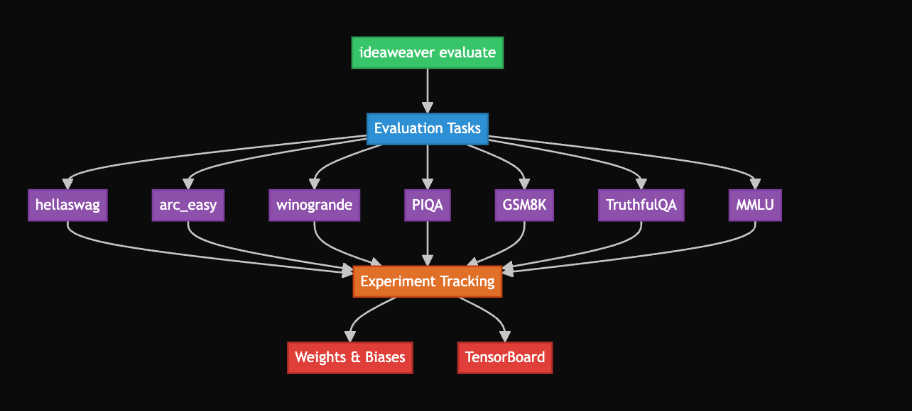

# Evaluation

Welcome to the Evaluation section! Here you'll find:
- How to run model evaluation with IdeaWeaver
- Examples for both TensorBoard and Weights & Biases (wandb)
- Screenshots and sample outputs

---



## TensorBoard Example

```bash
ideaweaver evaluate ./my-qwen2-model \
  --tasks hellaswag,arc_easy \
  --batch-size 2 \
  --output-path ./evaluation_results.json \
  --generate-report \
  --report-to tensorboard \
  --tensorboard-project my-eval-project \
  --limit 2 \
  --verbose
```

Example output:
```
🚀 Starting LLM evaluation for model: ./my-qwen2-model
📊 Tracking with: tensorboard
🚀 TensorBoard tracker initialized
   📁 Log directory: tensorboard_logs/ideaweaver-evaluation/._my_qwen2_model_20250605_192537
   🏷️  Experiment: ._my_qwen2_model_20250605_192537
   🌐 View with: tensorboard --logdir=tensorboard_logs
✅ TensorBoard tracking initialized
   📁 Log directory: tensorboard_logs/ideaweaver-evaluation/._my_qwen2_model_20250605_192537
✅ Local model found: ./my-qwen2-model
wandb: Tracking run with wandb version 0.19.11
wandb: W&B syncing is set to `offline` in this directory. Run `wandb online` or set WANDB_MODE=online to enable cloud syncing.
wandb: WARNING URL not available in offline run
✅ Wandb initialized: None
📊 Starting evaluation on tasks: hellaswag, arc_easy
📁 Output path: ./evaluation_results.json
🔧 Running command: lm_eval --model hf --model_args pretrained=./my-qwen2-model --tasks hellaswag,arc_easy --device auto --batch_size 2 --output_path ./evaluation_results.json --log_samples --limit 2 --wandb_args project=None
✅ Evaluation completed in 124.13 seconds
📋 Evaluation output:
hf (pretrained=./my-qwen2-model), gen_kwargs: (None), limit: 2.0, num_fewshot: None, batch_size: 2
|  Tasks  |Version|Filter|n-shot| Metric |   |Value|   |Stderr|
|---------|------:|------|-----:|--------|---|----:|---|-----:|
|arc_easy |      1|none  |     0|acc     |↑  |    0|±  |     0|
|         |       |none  |     0|acc_norm|↑  |    1|±  |     0|
|hellaswag|      1|none  |     0|acc     |↑  |    0|±  |     0|
|         |       |none  |     0|acc_norm|↑  |    0|±  |     0|

⚠️  No results.json found, creating basic results structure
✅ Results logged to Weights & Biases
📊 Logging evaluation results to TensorBoard...
   ✅ Logged 0 task results
✅ Evaluation completed successfully!
📄 Enhanced report saved to: tensorboard_logs/ideaweaver-evaluation/._my_qwen2_model_20250605_192537/evaluation_report_._my-qwen2-model.md

📊 Evaluation Summary:
✅ Experiment completed!
   ⏱️  Duration: 125.60 seconds
   📁 Logs saved to: tensorboard_logs/ideaweaver-evaluation/._my_qwen2_model_20250605_192537
   🌐 View with: tensorboard --logdir=tensorboard_logs

🌐 View results in TensorBoard:
   tensorboard --logdir=tensorboard_logs
   Then open: http://localhost:6006
wandb: 
wandb: You can sync this run to the cloud by running:
wandb: wandb sync /Users/plakhera/Documents/model-registry/wandb/offline-run-20250605_192537-rt62gdgo
wandb: Find logs at: wandb/offline-run-20250605_192537-rt62gdgo/logs
```

#### TensorBoard UI Example


---

## Weights & Biases (wandb) Online Example

```bash
WANDB_MODE=online WANDB_API_KEY=XXXXXX ideaweaver evaluate ./my-qwen2-model \
  --tasks hellaswag,arc_easy \
  --batch-size 2 \
  --output-path ./evaluation_results_wandb \
  --generate-report \
  --report-to wandb \
  --wandb-project my-eval-project \
  --limit 2 \
  --verbose
```

Example output:
```
🚀 Starting LLM evaluation for model: ./my-qwen2-model
📊 Tracking with: wandb
✅ Local model found: ./my-qwen2-model
wandb: Currently logged in as: laprashant (laprashant-startup) to https://api.wandb.ai. Use `wandb login --relogin` to force relogin
wandb: Tracking run with wandb version 0.19.11
wandb: Run data is saved locally in /Users/plakhera/Documents/model-registry/wandb/run-20250605_201404-irki0njw
wandb: Run `wandb offline` to turn off syncing.
wandb: Syncing run autumn-shadow-1
wandb: ⭐️ View project at https://wandb.ai/laprashant-startup/my-eval-project
wandb: 🚀 View run at https://wandb.ai/laprashant-startup/my-eval-project/runs/irki0njw
✅ Wandb initialized: https://wandb.ai/laprashant-startup/my-eval-project/runs/irki0njw
📊 Starting evaluation on tasks: hellaswag, arc_easy
📁 Output path: ./evaluation_results_wandb
🔧 Running command: lm_eval --model hf --model_args pretrained=./my-qwen2-model --tasks hellaswag,arc_easy --device auto --batch_size 2 --output_path ./evaluation_results_wandb --log_samples --limit 2 --wandb_args project=my-eval-project
✅ Evaluation completed in 117.12 seconds
📋 Evaluation output:
hf (pretrained=./my-qwen2-model), gen_kwargs: (None), limit: 2.0, num_fewshot: None, batch_size: 2
|  Tasks  |Version|Filter|n-shot| Metric |   |Value|   |Stderr|
|---------|------:|------|-----:|--------|---|----:|---|-----:|
|arc_easy |      1|none  |     0|acc     |↑  |    0|±  |     0|
|         |       |none  |     0|acc_norm|↑  |    1|±  |     0|
|hellaswag|      1|none  |     0|acc     |↑  |    0|±  |     0|
|         |       |none  |     0|acc_norm|↑  |    0|±  |     0|

⚠️  No results.json found, creating basic results structure
✅ Results logged to Weights & Biases
✅ Evaluation completed successfully!
📄 Evaluation report saved to: evaluation_report_._my-qwen2-model.md
📄 Report saved to: evaluation_report_._my-qwen2-model.md

📊 Evaluation Summary:
   dummy_task - dummy_metric: 1.0000
wandb: 
wandb: Run history:
wandb: dummy_task_dummy_metric ▁
wandb:     evaluation_duration ▁
wandb:               num_tasks ▁
wandb: 
wandb: Run summary:
wandb: dummy_task_dummy_metric 1
wandb:     evaluation_duration 117.1197
wandb:               num_tasks 2
wandb: 
wandb: 🚀 View run autumn-shadow-1 at: https://wandb.ai/laprashant-startup/my-eval-project/runs/irki0njw
wandb: ⭐️ View project at: https://wandb.ai/laprashant-startup/my-eval-project
wandb: Synced 5 W&B file(s), 1 media file(s), 2 artifact file(s) and 0 other file(s)
wandb: Find logs at: ./wandb/run-20250605_201404-irki0njw/logs
✅ Wandb run finished
/opt/homebrew/Cellar/python@3.12/3.12.10_1/Frameworks/Python.framework/Versions/3.12/lib/python3.12/tempfile.py:940: ResourceWarning: Implicitly cleaning up <TemporaryDirectory '/var/folders/zh/6p21kgbs2p192mpqm1csfd3r0000gn/T/tmpr6z8m8xf'>
  _warnings.warn(warn_message, ResourceWarning)
```

#### wandb UI Example

 