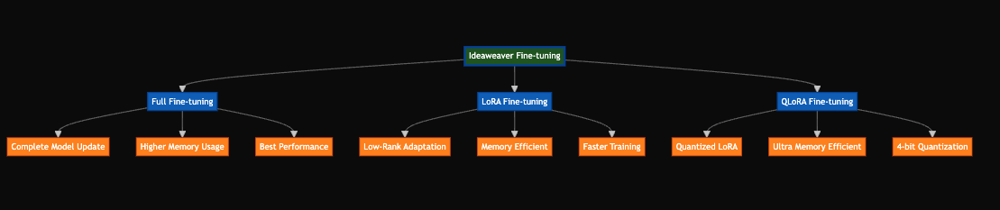

# Fine-tuning Methods

## Fine-tuning Methods Overview

Ideaweaver supports four main fine-tuning approaches, each designed for different use cases and resource constraints:

### 1. Full Fine-tuning
- **Complete Model Update**: Updates all model parameters
- **Higher Memory Usage**: Requires more GPU memory
- **Best Performance**: Achieves optimal results but at higher resource cost

### 2. LoRA Fine-tuning
- **Low-Rank Adaptation**: Uses efficient parameter updates
- **Memory Efficient**: Requires significantly less memory
- **Faster Training**: Quicker training with good performance

### 3. QLoRA Fine-tuning
- **Quantized LoRA**: Combines quantization with LoRA
- **Ultra Memory Efficient**: Minimal memory requirements
- **4-bit Quantization**: Uses 4-bit precision for maximum efficiency

### 4. Train & Quantize
- **Training + Quantization**: Combines both processes
- **Multiple Quant Methods**: Supports int8 and gguf quantization
- **Optimized Deployment**: Ready for production deployment

## Color Legend
- 🟢 **Dark Green**: Main Ideaweaver node
- 🔵 **Blue**: Fine-tuning methods
- 🟠 **Orange**: Features and characteristics

## When to Use Each Method

1. **Full Fine-tuning**: When you have sufficient GPU memory and need the best possible performance
2. **LoRA**: When you want a good balance between performance and resource usage
3. **QLoRA**: When working with limited GPU memory or large models
4. **Train & Quantize**: When you need an optimized model for deployment 